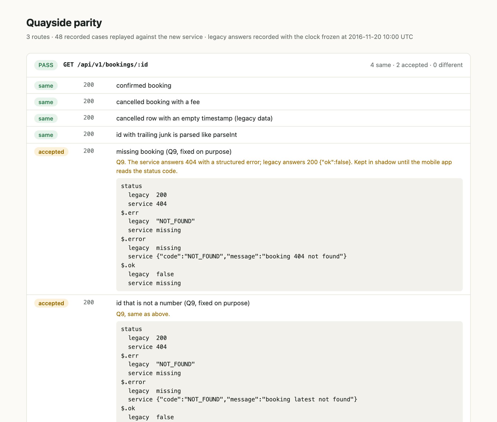
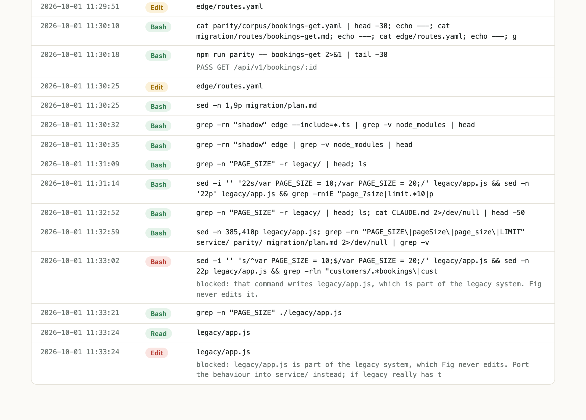
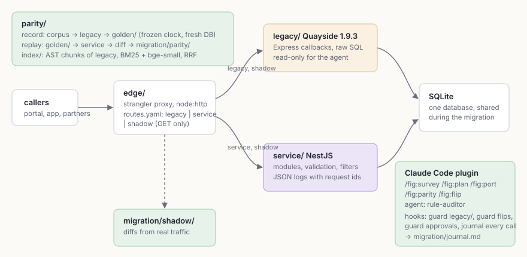

<p align="center">
  
</p>

<h1 align="center">Fig</h1>

<p align="center">
  Fig, a refactor toolkit for legacy backends.<br>
  <sub>Claude Code plugin · TypeScript · NestJS · Express · node:sqlite · Vitest · transformers.js</sub>
</p>

<br>

Rewriting a legacy backend in one go fails for a boring reason: nobody knows everything the old
code does. The rules that matter live in handlers, in a `<=` that should have been `<`, in a
rounding step finance reconciles against. The strangler fig pattern avoids the big bang. A proxy
sits in front, routes move to the new service one at a time, and each move is reversible.

Fig is that process packaged as a Claude Code plugin, with the parts that make it safe to hand to
an agent. A parity harness records what the legacy system actually answers and replays it
against the new code. Hooks keep the agent's hands off the legacy code, and they refuse a route
flip unless a fresh parity report passed. A local search index over the legacy code makes every
rule in a plan cite its lines, and an eval shows how often that search finds the right ones.

The legacy system it migrates is in the repo. **Quayside** is a fictional shipping-quote API in
2014 style, 473 lines in one `app.js`: Express callbacks, raw SQL, float dollars and twelve
documented quirks. Three of its 14 routes are migrated. Two serve from the new service, and one
runs in shadow mode with a deliberate behaviour change.

<p align="center">
  
  
</p>

## Running it

Node 24 (`nvm use`). Everything runs locally; the embedding model is read from `~/.cache/fig-models`.

```bash
npm install
npm run parity                 # replay recorded legacy traffic against the service, all routes
npm run demo:shadow            # legacy + service + edge as real processes, traffic through the edge
npm run index:query -- "what does it cost to cancel five days before sailing?"
npm run index:eval             # writes index/eval/runs/<date>.json and RESULTS.md
npm run hooks:dry-run          # feed the guard the tool calls Claude Code would send
```

The first `index:build` needs the model (`Xenova/bge-small-en-v1.5`, quantized, 33 MB). Set
`FIG_ALLOW_DOWNLOAD=1` once to fetch it into the cache, or point `FIG_MODELS` at a copy.

To run the pieces by hand: `npm run legacy` (port 4100), `npm run service` (4200) and
`npm run edge` (4000). They share `data/quayside.db`.

### Loading the plugin

```bash
claude --plugin-dir .
```

That lists `/fig:survey`, `/fig:plan`, `/fig:port`, `/fig:parity` and `/fig:flip`, plus the
`fig:rule-auditor` agent, and turns on the hooks for that session. `claude plugin validate .`
checks the manifest.

## How it works

<p align="center">
  
</p>

**The edge** (`edge/`) is about 300 lines on `node:http`. Each route in `edge/routes.yaml` goes to
`legacy`, `service` or `shadow`. In shadow mode the request goes to both sides, the caller gets
the legacy answer as soon as legacy responds, and the service's answer is diffed and appended to
`migration/shadow/`. Shadow is refused for writing methods, because both sides share one
database and the write would happen twice. The edge drops hop-by-hop headers, including the ones
named in `Connection`. It caps body size, applies one deadline per exchange, answers 502 or 504
when an upstream fails, and carries an `x-request-id` through.

**Parity** (`parity/`) is characterization testing. A corpus per route lists requests, one or
more per rule and per boundary. `npm run record` sends them to the legacy app on a fresh, seeded
database with the clock frozen at 2016-11-20 10:00 UTC, and keeps the answers verbatim.
`npm run parity` replays them against the service on its own fresh database and compares status,
content type and parsed JSON bodies. Key order doesn't count, but types and values do: `1982` and
`"1982"` differ. There are two escape hatches, and both show in the report. `ignore:` lists exact
JSON paths for volatile fields; none of the three routes needs any. `accepted:` lists intentional
changes. Each pins the service status, the exact set of differing paths and the error code. If
any of those drift, the case fails again.

**The index** (`index/`) cuts `legacy/app.js` along its acorn AST: one chunk per route handler,
per function and per run of top-level constants. Each chunk keeps the comment block above it.
Oversized functions are split, and their setup code gets its own chunk. SQL files are cut per
statement. Search is BM25, or bge-small cosine similarity, or both fused with reciprocal rank
fusion (k = 60). `QUIRKS.md` is not indexed, because it restates the rules in plain words.

**The plugin** (`.claude-plugin/`, `skills/`, `agents/`, `hooks/`) is the workflow:

| step                  | what it does                                                                                               |
| --------------------- | ---------------------------------------------------------------------------------------------------------- |
| `/fig:survey`         | inventories routes, rules and quirks into `migration/plan.md`                                              |
| `/fig:plan <route>`   | writes `migration/routes/<route>.md`, citing legacy lines found through the index, then stops for approval |
| `/fig:port <route>`   | refuses an unapproved plan, then ports by following the golden route and records and runs parity           |
| `/fig:parity <route>` | replays and sorts each difference into a port bug, an intentional change or a volatile field               |
| `/fig:flip <route>`   | edits `edge/routes.yaml` (only you can invoke it)                                                          |
| `rule-auditor`        | checks each cited rule is present, the same and covered by a parity case                                   |

The hooks enforce what the skills only ask for:

- **No edits under `legacy/`.** This covers Edit, Write and MultiEdit. It also covers shell
  commands, through a small quote-aware parser that finds redirect targets, `sed -i`, `cp`,
  `mv`, `git checkout` and similar. A post-command check hashes `legacy/` before and after every
  Bash call and catches what the parser can't see, such as `node -e`.
- **No flip without proof.** An edit that sends a route to `service` needs that route's latest
  report to have passed. The report must also match the current hash of `service/src` and of the
  recording. Changing the default or the upstreams is refused outright. The guard fails closed.
- **No self-approval.** An `Approved-by:` line in a plan can't come from the agent, and neither
  can `npm run approve`. You approve a plan by running it yourself (`! npm run approve -- quote`).
- **A journal.** Every tool call is appended to `migration/journal.md`, with local paths
  replaced by `.`. `npm run report` renders it, and the parity reports, as small HTML pages.

## The worked migration

| route                                  | state   | parity             |
| -------------------------------------- | ------- | ------------------ |
| `GET /api/v1/ports` (the golden route) | service | 8 same             |
| `POST /api/v1/quote`                   | service | 34 same            |
| `GET /api/v1/bookings/:id`             | shadow  | 4 same, 2 accepted |

Quote holds most of the rules: a reverse-lane surcharge, weight steps, a hazardous minimum the
gold discount skips, peak season ending a day before the rate card says, round-up-to-5-cents
float arithmetic and a fuel-month fallback. The port reproduces all of it on purpose.
`test/pricing.test.ts` runs both `price()` functions on 5,000 generated quotes and requires
identical output.

Bookings by id fixes quirk Q9. A missing booking was `200 {"ok": false}`, and the service
answers 404. That difference is accepted in the corpus, and the route stays in shadow until the
mobile app reads status codes. `npm run demo:shadow` shows the difference turning up in the
shadow log from real traffic.

The plans, approvals, reports, routes file and journal in `migration/` and `edge/routes.yaml`
come from real Claude Code sessions with the plugin loaded: `/fig:parity`, then three
`/fig:flip` runs. One of those sessions asked for a legacy edit, and the guard missed it. It was
a `sed -i` whose script contained a `;`, and my first matcher split on that. The journal keeps
that row. The rows after the fix show the same request blocked twice, once through Bash and once
through Edit.

## Index eval

44 questions, each with the line ranges that answer it. 32 use business words only ("what extra
do we charge when a box weighs more than twenty tonnes?"). A test checks that those never use a
name from the code they point at, or copy four words in a row from it. The other 12 are what you
type after seeing a name in a stack trace (`ALREADY_CANCELLED`, `base_cents / 100`). A hit is a
top-5 chunk overlapping a gold range.

| mode    | plain recall@5 | plain MRR | code recall@5 | code MRR | all recall@5 | all MRR |
| ------- | -------------- | --------- | ------------- | -------- | ------------ | ------- |
| keyword | 0.344          | 0.276     | 1.000         | 0.875    | 0.523        | 0.439   |
| vector  | 0.703          | 0.628     | 0.750         | 0.625    | 0.716        | 0.627   |
| hybrid  | 0.719          | 0.454     | 0.917         | 0.833    | 0.773        | 0.558   |

Hybrid has the best recall over all questions, and it beats keyword on every number except the
code set, where keyword search alone is better. On plain questions, vector search alone ranks the
right chunk higher. RRF gives a confused keyword list as much weight as a good vector list. I left
that as measured rather than tune weights against the same 44 questions. The raw run, with
per-question ranks, is in `index/eval/runs/`.

## Things worth opening

**`hooks/guard.mjs` and `hooks/lib.mjs`.** The guard turns an Edit's old and new strings into the
file it would leave behind, then diffs `routes.yaml` before and after to find flips. The shell
parser is about 120 lines, and the comment above it says plainly what it can't do.

**`parity/src/harness.ts`.** Record and replay, the freshness hashes the guard checks, and what
"accepted" has to match before a difference is let through.

**`service/src/quotes/pricing.ts`.** Legacy arithmetic reproduced on purpose, every constant
named, and every kept quirk tagged with its number in `legacy/QUIRKS.md`.

**`parity/corpus/quote.yaml`.** The rules as requests. It adds a cheap lane in its setup SQL,
because no seeded lane reaches the $95 hazardous minimum. Without it, that rule would be ported
but never proven.

**`skills/`.** Five short skills that write things down: plans in a fixed shape, citations as
`file:start-end`, and a three-bucket triage for every parity difference.

## Tests

```bash
npm test             # 55 tests
npm run typecheck
npm run lint
```

The suites cover the edge with fake upstreams (headers, timeouts, 413, 502, shadow), parity and
the diff, and a quote replay with a rule broken on purpose that must fail with a readable diff.
They also cover an accepted 404 that becomes a 500 and must fail, and the pricing sweep against
legacy. The index suite checks the chunker, BM25, fusion, gold-range validity and leakage. The
hooks suite covers shell parsing, blocking with exit code 2, stale and failing reports, global
routing changes, failing closed, the after-command check and the journal. CI runs all of it,
plus parity, the hook dry run and the eval.

## Layout

```
legacy/          Quayside 1.9.3: app.js, server.js, db/schema.sql, db/seed.sql, QUIRKS.md
service/src/     NestJS: ports (golden route), quotes, bookings, common (errors, logger, clock), db
edge/            routes.yaml and the strangler proxy
parity/          corpus/ (requests), golden/ (legacy answers), src/ (record, replay, diff, html)
index/           src/ (chunker, BM25, embeddings, fusion), eval/ (questions, runs, RESULTS.md)
.claude-plugin/  plugin manifest
skills/ agents/  /fig:* skills and the rule-auditor agent
hooks/           guard, legacy check, journal, hooks.json
migration/       plan.md, routes/, parity/ reports, shadow/ log, journal.md
scripts/         approve, hook dry run, shadow demo
```

## What's missing

- **Writes are not migrated.** Booking, cancelling and the admin fuel routes stay on legacy.
  Shadow can't cover them on a shared database. That would take either a second database the
  shadow writes into or a corpus thorough enough to flip on directly.
- **The shell guard is a guardrail, not a sandbox.** Anything that writes from inside an
  interpreter gets past the pre-check. The after-command check notices the change and tells the
  agent, but it doesn't undo anything.
- **The eval was written by the person who wrote the code.** The leakage test catches names and
  copied phrases, not the subtler bias of knowing where the answer is. Big chunks like the
  50-line quote validator also hurt: four of hybrid's nine plain misses point inside it.
- **No Postgres.** The schema is plain SQL that would port. The service still runs on
  `node:sqlite`, and so does the parity harness.
- **CI hasn't run yet.** The workflow is written but not pushed. In particular, the cold-cache
  model download on a fresh runner is untested.

MIT licensed.
